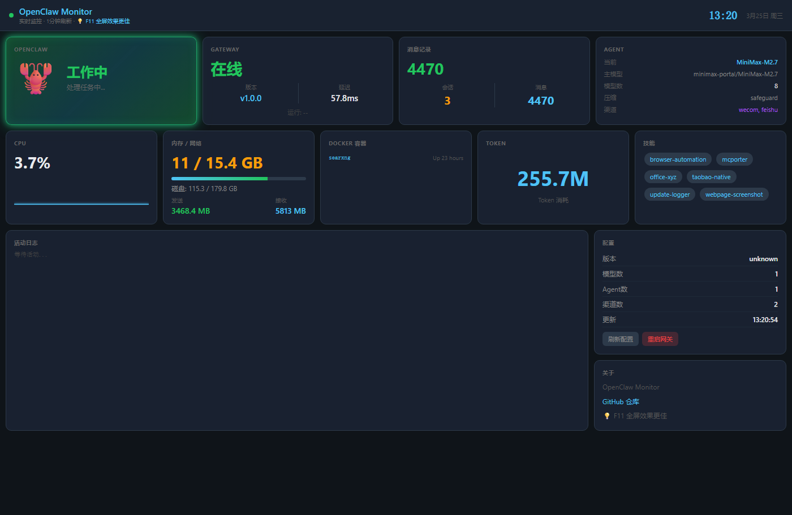

# OpenClaw Monitor

实时监控面板，展示 OpenClaw AI 系统的运行状态、会话信息、Token 消耗等数据。



## 功能

| 模块 | 说明 |
|------|------|
| **Gateway** | 在线状态、版本、延迟、运行时间 |
| **OpenClaw 状态** | 工作中 / 空闲中 / 休息中，带动态呼吸灯效果 |
| **Token 消耗** | 从 transcript 文件读取，累计 Input/Output 总量 |
| **CPU** | 实时占用率 + 折线图 |
| **内存 / 网络** | 内存使用率进度条 + 流量收发统计 |
| **磁盘** | C盘使用情况 |
| **Docker** | 容器运行状态 |
| **Agent** | 当前模型、主模型、模型数、压缩模式、渠道 |
| **技能** | 已加载的 Skills 列表 |
| **关于** | GitHub 链接、F11 全屏提示 |
| **活动日志** | 会话更新事件实时滚动 |

## 安装

### 依赖

- Python 3.9+
- [OpenClaw](https://github.com/openclaw/openclaw) 已运行

### 步骤

```bash
# 1. 克隆仓库
git clone https://github.com/2398954487/openclaw-monitor.git
cd openclaw-monitor

# 2. 安装依赖
pip install -r requirements.txt

# 3. 启动
python app.py
# 或双击 start.bat（Windows）

# 4. 打开浏览器
# http://localhost:19100
```

## 配置

> ⚠️ **安全提示**：默认只监听 `127.0.0.1`（本机），外网无法访问。如需局域网访问可改为 `0.0.0.0`。

编辑 `config.json`：

```json
{
  "server": {
    "host": "127.0.0.1",
    "port": 19100,
    "title": "OpenClaw Monitor"
  },
  "refresh_interval": 60000,
  "openclaw": {
    "dir": "~/.openclaw",
    "gateway_url": "http://127.0.0.1:18789"
  },
  "features": {
    "camera": false,
    "docker": false
  },
  "theme": {
    "background_image": "",
    "background_color": "#0f1419"
  }
}
```

## 项目结构

```
openclaw-monitor/
├── app.py              # Flask 后端
├── config.json         # 配置文件
├── requirements.txt    # Python 依赖
├── start.bat           # Windows 启动脚本
├── README.md
├── screenshot.png
└── templates/
    └── index.html     # 前端页面
```

## License

MIT
